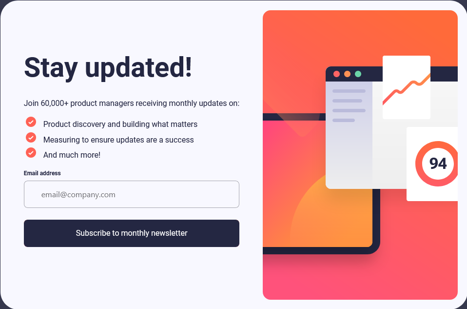

# Newsletter sign-up form with success and error states

<<<<<<< Updated upstream
This is a solution to the [Newsletter sign-up form with success message challenge on Frontend Mentor](https://www.frontendmentor.io/challenges/newsletter-signup-form-with-success-message-3FC1AZbNrv).  
=======
This is my attempt at a common IoT programming pattern that requests input from a user and can display an error state for prompting the user for revised data or a success state indicating a succesful interaction.
>>>>>>> Stashed changes

## Table of contents

- [Frontend Mentor - Newsletter sign-up form with success message solution](#frontend-mentor---newsletter-sign-up-form-with-success-message-solution)
  - [Table of contents](#table-of-contents)
  - [Overview](#overview)
    - [The challenge](#the-challenge)
    - [Screenshot](#screenshot)
    - [Links](#links)
  - [My process](#my-process)
    - [Built with](#built-with)
    - [What I learned](#what-i-learned)
    - [Continued development](#continued-development)
  - [Author](#author)


## Overview

### The challenge

Users should be able to:

- Add their email and submit the form
- View a success state after after successfully submitting the form with a valid email
- See form validation messages if:
  - The field is left empty
  - The email address is incorrectly formatted
- View the optimal layout for the interface depending on their device's screen size
- See hover and focus states for all interactive elements on the page

### Screenshot




### Links

- Solution URL: [Add solution URL here](https://your-solution-url.com)
- Live Site URL: [Add live site URL here](https://your-live-site-url.com)

## My process

### Built with

- Semantic HTML5 markup
- CSS custom properties
- Flexbox
- Bulma library
- Mobile-first workflow
- Custom created modal


### What I learned

For this project I utylized a mobile-first design with variable fonts, image sizing and media queries. The HTML framework was kept simple with minimal usage of div containers. The styling was created with more use of helper classes and the resuse of simple animations in mind. Later into the implementation stage of development, an issue with CSS was encountered that prevented animating the opacity of a button element with a gradient background. My solution was to render the button positioned absolutely over a div element with the gradient background. Upon hovering, the button's background is transitioned to transparent therefor giving the intended effect.

```html
<div class="button-parent-div">
  <div class="gradient-background"></div>
  <button class="button-submit">
    Subscribe to monthly newsletter
  </button>
</div>
```
```css
.button-parent-div {
    position: relative;
}
.gradient-background {
    background: linear-gradient(to bottom, #FF6A3A, #FF527B);
}
.button-submit {
    position: absolute;
    top: 0;
    background-color: #242742;
    transition: background-color 400ms;
}
.button-parent-div:hover .button-submit {
    background-color: transparent;
}
```
Some of my favorite code to write was an entire modal class with custom properties and methods. A message, title, image and button text can be used to create a custom popup using two different methods. The prompt method can be used to prompt the user for input while the confirm method solely serves as a message to the user. Once created, a modal can be passed a function to execute upon a positive event, or another function that execute upon a negative event.
```js
if (checkEmailValidity()) {

  const title = "Thanks for subscribing!"
  const imgAddress = "./newsletter-sign-up-with-success-message-main/assets/images/icon-success.svg"
  const email = emailField.value
  const message = `A confirmation email has been sent to ${email}. Please open it and click the button inside to confirm your subscription.`
  const btnMessage = "Dismiss message"

  const modal = new Modal(message, title, btnMessage, null, imgAddress);

  modal.confirm()

  removeInvalidEmailReponse()

} else {

  addInvalidEmailResponse()

}
```


### Continued development

In future projects I would like to get more experience creating mobile friendly designs as well as leveraging existing libraries to solve problems and create seamless applications.


## Author

- Website - [Geo Archbold](https://geo-bold.dev)
- Frontend Mentor - [@Geo-Bold](https://www.frontendmentor.io/profile/yourusername)
