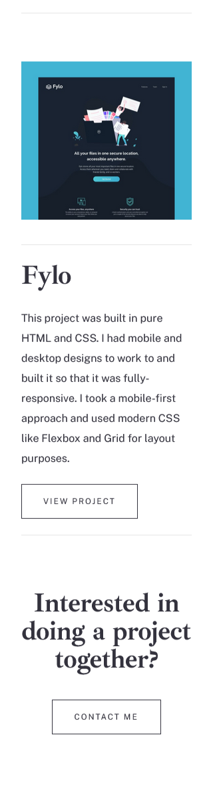

# Minimalist portfolio website

This is a solution to the [Minimalist portfolio website challenge on Frontend Mentor](https://www.frontendmentor.io/challenges/minimalist-portfolio-website-LMy-ZRyiE). 

## Table of contents

- [Minimalist portfolio website](#minimalist-portfolio-website)
  - [Table of contents](#table-of-contents)
  - [Overview](#overview)
    - [The challenge](#the-challenge)
    - [Screenshot](#screenshot)
    - [Links](#links)
  - [My process](#my-process)
    - [Built with](#built-with)
    - [What I learned](#what-i-learned)
      - [Allow the browser to do the work](#allow-the-browser-to-do-the-work)
      - [Libraries are the shoulders of giants, stand on them](#libraries-are-the-shoulders-of-giants-stand-on-them)
    - [Continued development](#continued-development)
    - [Useful resources](#useful-resources)
  - [Author](#author)
  - [Acknowledgments](#acknowledgments)

## Overview

### The challenge

Users should be able to:

- View the optimal layout for each page depending on their device's screen size
- See hover states for all interactive elements throughout the site
- Click the "About Me" call-to-action on the homepage and have the screen scroll down to the next section
- Receive an error message when the contact form is submitted if:
  - The `Name`, `Email Address` or `Message` fields are empty should show "This field is required"
  - The `Email Address` is not formatted correctly should show "Please use a valid email address"

### Screenshot

### Links

-  [Solution URL:](https://www.frontendmentor.io/profile/Geo-Bold)
-  [Live Site URL:](https://geobold.dev/portfolio)

## My process

### Built with

- Semantic HTML5 markup
- CSS custom properties
- Flexbox and Grid
- Desktop-first design
- Mobile-responsive workflow
- Framework: [Bulma](https://styled-components.com/) provides ready-to-use frontend components

### What I learned

Just after the completion of the [newsletter project](https://geobold.dev/newsletter/index.html), I began purusing the challenges in search of my next giant to slay. It was not long after laying eyes on this challenge that I was hooked. The minimalistic elegance and grace of the design was eye-catching and the fact that it was a complete website sealed my fate. Little did I know what was in store for me for dragging my skills, kicking and screaming, this far into the unknown. I crafted a plan for a week, trying to determine the best way of completing this heist. Once I had a shaky understanding of what I wanted to do, I immediately faced the biggest challenge of this entire project. Starting. Once I summoned the courage to begin, the site rapidly began assuming shape and before I knew it I found myself finished, writing this well-crafted if not extremely verbose and unneccessary summary of my work. However, after slaying this dragon in a fassion that I can proudly call mine, I see it fit to enjoy the fruits of my labor. Below is a succint summary of two of the lessons learned along the way.

#### Allow the browser to do the work

I started this project with a pixel-perfect mindset. The solution was going to match every inch of the designer's vision which mean that every height, width, margin and font-size was going to be coded. I understood some vague concept of responsiveness, but failed to realize my mindset was antithetical to its very spirit. Once the desktop and tablet designs were complete, I realized with my work on the mobile layout that I had made some drastic mistakes. At this point I learned one of my most valuable lessons from front end legend, Kevin Powell: when first created, all websites are responsive; if at some point they lose this capability it is always because of code you wrote. Needless to say, I went back through my stylesheet and culled every mention of a specific height and width and utilyzed min and max values instead.

#### Libraries are the shoulders of giants, stand on them

The more I learn, the more I realize how little I know. While it is important to build a strong foundation in the basics and develop a keen understanding of how certain mechanisms work, I do not think there is utility in creating everything from scratch. There are libraries that have been created by other pioneers forging courageous paths so that we can run where they trudged; all we need do is receive the gift they have bestowed and credit their efforts. In my project I use [Bulma](https://styled-components.com/) to create styled and ready to deploy elements which can allow my focus to be placed elsewhere. Additionaly, in this project I utylize an amazing css only svg animation called [flippin' burgers](https://codepen.io/ainalem/pen/LJYRxz) by Mikael Ainalem for the nav burger menu. These tools save time and for them I am grateful.

### Continued development

Working on this project allowed me to use grid for the first time. After learning enough to attempt a semi-competent application in a responsive layout I can agree that more experience with grid can allow the development of interesting product cards. Additionaly, I used absolute positioning for the first time. This tool can allow for unorthodox placement of elements in the DOM and I will be using it in the future.

### Useful resources

- [Kevin Powell](https://www.kevinpowell.co/) - His videos explaining responsive design were quite useful.
- [Web Dev Simplified](https://www.youtube.com/@WebDevSimplified/featured) - Clean, clear and descriptive videos detailing new HTML and CSS features or showcasing existing features help stimulate my creativity and problem solving.
- [MDN](https://developer.mozilla.org/en-US/) = A classic tool to discover more about every aspect of front end development.

## Author

- Website - [Geo Archbold](https://geobold.dev)
- Frontend Mentor - [@Geo-Bold](https://www.frontendmentor.io/profile/Geo-Bold)
- Twitter - [@a_edgeorge](https://x.com/a_edgeorge)

## Acknowledgments

A special thank you to Peter W. and Jenna D. for their help with product testing and discovering bugs.
