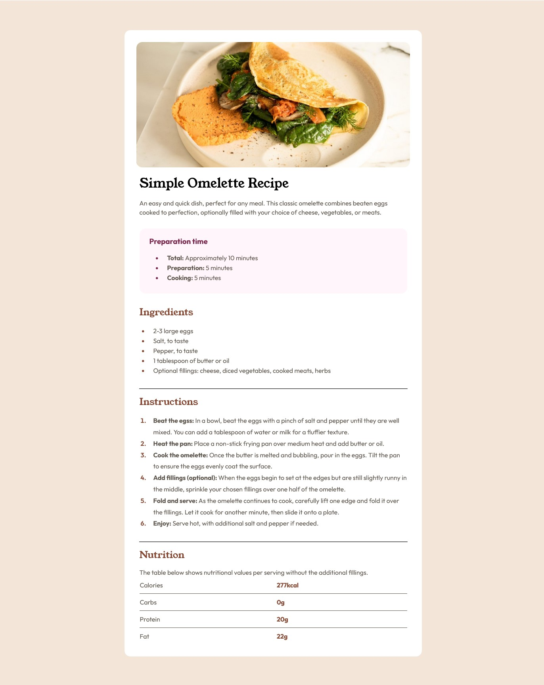

# Frontend Mentor - Recipe Page
 

## Table of contents

- [Overview](#overview)
  - [The challenge](#the-challenge)
  - [Screenshot](#screenshot)
  - [Links](#links)
- [My process](#my-process)
  - [Built with](#built-with)
  - [What I learned](#what-i-learned)
  - [Useful resources](#useful-resources)
- [Author](#author)
- [Acknowledgments](#acknowledgments)

## Overview

### Screenshot

A satisfied customer and a completed project!

### Links

- Solution URL: [Add solution URL here](https://your-solution-url.com)
- Live Site URL: [Add live site URL here](https://your-live-site-url.com)

## My process

### Built with

- Semantic HTML5 markup
- CSS custom properties
- Flexbox

### What I learned

Although quite a simple project, this allowed me to polish my HTML and CSS skills while practice initializing, pushing and committing to Git. 

### Useful resources

- [Flexbox](https://css-tricks.com/snippets/css/a-guide-to-flexbox/) - This helped me understand and remember the flexbox rule sets. 

## Author

- Website - [Geo]
- Frontend Mentor - [@Geo-Bold](https://www.frontendmentor.io/profile/geo-bold)

## Acknowledgments

Thank you to Kelvin Nguyen for working and learning with me.

